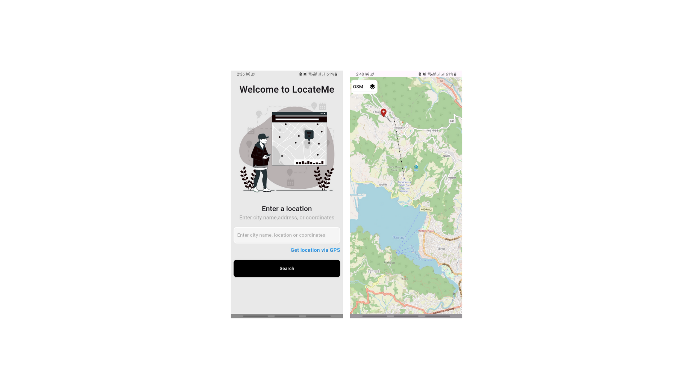

<p align="center">
  
</p>

<br/>

<h1 align="center"> 
 LocateMe 
</h1> 


<sub>

## 🌏 Related websites
> Flutter official website: [https://flutter.dev/](https://flutter.dev/)
> Packages (original site): [https://pub.dev/](https://pub.dev/)

## 🛠️ Development environment

### 🛠️ Basic environment

Windows:
```
[√] Flutter (Channel stable, 3.22.2, on Microsoft Windows [Version 10.0.22621.3007], locale zh-CN)
[√] Android toolchain -develop for Android devices (Android SDK version 34.0.0)
[√] Visual Studio -develop Windows apps (Visual Studio Community 2022 17.9.6)
[√] Android Studio (version 2023.3)
[√] IntelliJ IDEA Ultimate Edition (version 2024.1)
[√] VS Code (version 1.90.0)
```  

macOS:   
```
[✓] Flutter (Channel stable, 3.22.2, on macOS 14.4.1 23E224 darwin-x64, locale zh-Hans-CN)
[✓] Android toolchain -develop for Android devices (Android SDK version 34.0.0)
[✓] Xcode -develop for iOS and macOS (Xcode 15.4)
[✓] Android Studio (version 2023.3)
[✓] VS Code (version 1.89.1)
```  


